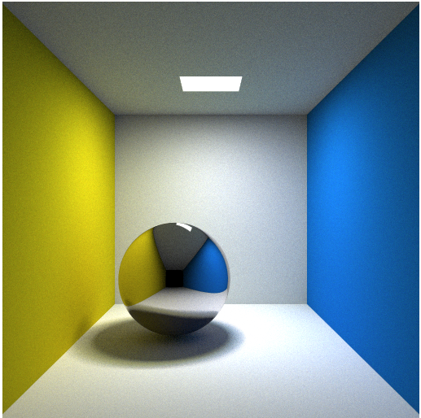

# Sail
a path tracer using WebGL for realtime performance

*Sail*是一个基于Webgl技术实现的具有实时表现的路径追踪器

## 渲染结果展示

1. 康奈尔盒子

2. 金属、镜面、漫反射表面材质


## 特性

1. 使用基本视线路径追踪方法
2. 无偏性
3. 使用直接光照、间接光照混合渲染
4. 实时可交互
5. 支持康奈尔盒子、棋盘、颜色三种纹理
6. 支持金属、镜面、漫反射三种材质
7. 面积光源
8. 支持球体、立方体、平面三种几何形状

## 运行

可以直接执行/test/index.html查看预设测试渲染结果。以下是测试代码及注释

```js
let canvas = document.getElementById('canvas');

let renderer = new Sail.Renderer(canvas);
let scene = new Sail.Scene();
//设置摄像机参数
let camera = new Sail.Camera([2.78,2.73,-6],[2.78,2.73,2.79]);

//创建材质、纹理
let matte = new Sail.Matte(1.0);
let metal = new Sail.Metal(0.1,0.01);
let mirror = new Sail.Mirror(1.0);
let cornellbox = new Sail.CornellBox([0,0,0],[5.560,5.488,5.592]);

//创建光源
scene.add(new Sail.Cube([2.13,5.487,2.27],[3.43,5.488,3.32],matte,Sail.Color.create([0,0,0]),[8,8,8]));
//创建盒子
scene.add(new Sail.Cube([0,0,-7],[5.560,5.488,5.592],matte,cornellbox));
//创建球体
scene.add(new Sail.Sphere([2,1.25,2.70],1.2,mirror,Sail.Color.create([1,1,1])));
//添加摄像机
scene.add(camera);
//创建控制器
let control = new Sail.Control(canvas,scene);
//提交场景数据
renderer.update(scene);
//渲染循环
function tick(){
    requestAnimationFrame(tick);
    renderer.render(scene);
}

tick();
```

想要修改源代码需要安装rollup。修改源代码后，在项目根目录下执行下面的代码编译项目
```shell
rollup -c
```
